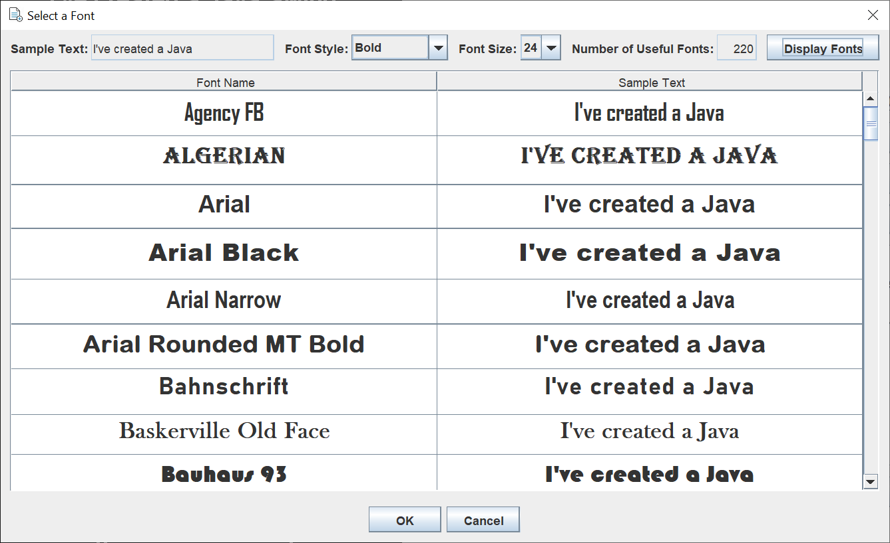
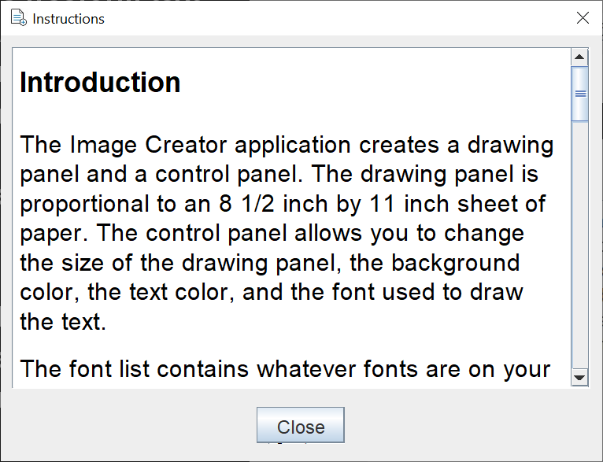

# Image Creator

## Introduction

I wanted to build a Java Swing GUI that would allow me to create an image of text that I could post on social media.  I also wanted to build a more complete Swing application as an example of how to create a more complex Swing GUI.

This application does both.

Here's what the application looks like when you start it.  The GUI is 952 x 610 pixels.

There's a drawing JPanel on the left and a control JPanel on the right.  The default drawing JPanel size is proportionate to an 8 1/2 inch by 11 inch sheet of paper.  The control JPanel allows you to set the dimensions of the drawing JPanel, set the background and text color, and set the font.

Here's an image of the GUI after I've typed in some text.  I increased the height of the drawing JPanel so the text would fit.  I left the drawing colors and font as the defaults.

The application took the freeform text I typed in the JTextArea and formatted it to fit on the drawing JPanel.  The paragraph code "\p" told the application to make a new paragraph.

This image shows the default JColorChooser as a dialog.  You can choose a color swatch or pick a specific color from one of the four color formats.

This image shows the font JDialog I created.  The dialog is a two-step process.  First, you select a font style and font size.  Left-click on the Display Fonts JButton in the upper right.  The dialog then checks all of the font families on your computer to see which fonts canh draw the sample text.  The sample text is the first 20 characters of the text you typed in the JTextArea.  You select a font by left-clicking on the font name.  The selection will be marked with a blue band across the row.  Left-click the OK JButton to select the new font.

I created an instruction JDialog.  I read the text into the JDialog each time the dialog is viewed.  The text is written using Markdown.  I convert the markup to HTML for display in the JTextPane.

The application has a File menu and a Help menu.  The file menu allows you to read a text file, write a text file, and write an image file.  The Help menu brings up the instructions dialog and an about JDialog.

This application was not designed for printing large text files, although you're welcome to try.  Fonts with large point sizes (16 and up) are easier to read when drawn.

## Explanation

If you’re not familiar with Java Swing, Oracle has an excellent tutorial to get you started, [Creating a GUI With JFC/Swing](https://docs.oracle.com/javase/tutorial/uiswing/index.html). Skip the Netbeans section.

When I write a Java Swing application, I use the [model / view / controller](https://en.wikipedia.org/wiki/Model%E2%80%93view%E2%80%93controller) (MVC) pattern.  This pattern allows me to separate my concerns and focus on one part of the application at a time.

When I say I use the MVC pattern in a Swing application, this is what I mean.

1. The view reads information from the model.
2. The view may not update the model.
3. The controller will update the model and revalidate / repaint the view.

In a Swing application, there can be many controller classes.  There's no one controller to "rule them all".

I wrote this application one small piece at a time, starting with the model, then the view, and finally the controller classes.  I tested each small piece many many times.  Some of the code I was able to get from other projects I completed.  You might recognize the font JDialog from another repository of mine.  Because I used the MVC pattern, I knew all the small pieces would fit together in a huge mosaic.

### Model

The ImageCreatorModel is a plain Java getter / setter class that holds the drawing JPanel dimension, the background color, the text color, the text font, and the text to draw.  Defaults are set in the class constructor.

This is a simple model, compared to other Swing applications I've written.  Still, I keep these fields in one place.

### View

The view consists of one JFrame, one drawing JPanel, one control JPanel, a Color JDialog, a Font JDialog, an instruction JDialog, and an about JDialog.  The JFrame has a JMenuBar.  I create the JMenuBar and JFrame in the ImageCreatorFrame class.  There are several getter / setter methods for reading from and writing to the drawing JPanel and the control JPanel.  This is so the controller cl;asses just reference the JFrame class.  There's no need for the controller classes to know how the JPanels work.  While this makes things seem more complicated, it enforces a separation of concerns that makes the code manageable.

The drawing JPanel extends JPanel so we can override the paintComponent method.  The only time you should extend a Swing component, or any Java class, is when you want to override one or more class methods.  The paintComponent method takes the text String, one word at a time, and sees if it will fit.  Once the maximum number of words is on a line, the line is drawn and the process repeats for the next line.

The drawing JPanel has a method to convert the panel image into an image format by using the printAll method.

The control JPanel allows the user to change the drawing JPanel dimensions, the background color, text color, and text font, as well as type the text to be drawn.  The control JPanel uses a GridBagLayout to layout all the different Swing components that make up the control JPanel.  I didn't design this JPanel.  I added a Swing component or two at a time and tested it until I got it to look like I wanted.

The instruction JDialog is a good example of a reusable component.  You can use the same code to create many different instruction dialogs.  Because the instructions are in a separate text file, it's easy to make changes with Notepad.

I created an OSFileChooser (Open Save) component by extending a JFileChooser.  I added code to the save process to check for a duplicate file name and give me a warning JOptionPane before overwriting an existing file.  I also added code to the save process to append an extension to the file name if there isn't one and a specific file type is selected.  Feel free to grab this component, along with the FileTypeFilter class, for your use.

### Controller

I wrote seven controller classes.  I also wrote numerous anonymous controller classes.  They all implement ActionListener, except for the FontDisplayRunnable class which I run in a Thread.  As you can tell by now, I name my controller classes (...Listener, ...Runnable) with the type of controller at the end of the name.  This helps me to know at a glance what type of controller class I'm looking at.
